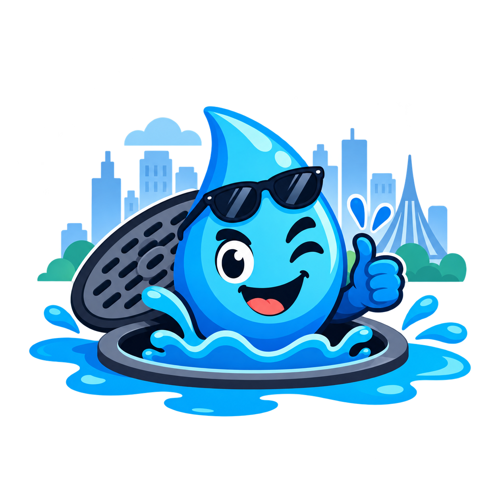
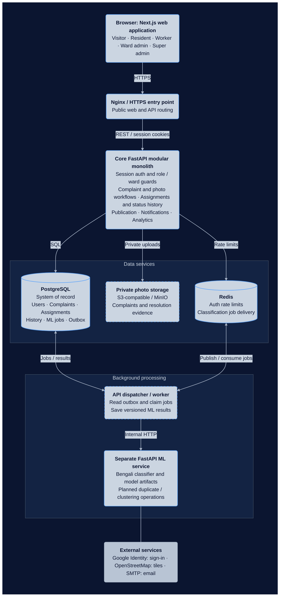

# DubsiBhai - Drainage Waterlogging Management for Dhaka

<p align="center">
  
  <br>
  <strong>Collaborative Community Platform</strong>
</p>

Urban waterlogging and drainage management for Dhaka. This repository contains the frontend, backend, and machine learning service for the DubsiBhai project. The frontend is built with Next.js, while the backend and ML service are built with FastAPI.

The repository root is `CSE-4113-Project/`.

- [Project structure](docs/architecture/MONOREPO_ARCHITECTURE.md)
- [System design](docs/architecture/SYSTEM_DESIGN.md)

## High-level architecture

The target architecture combines a FastAPI modular monolith with a separate ML
service. The core API owns business data, authorization, and workflow decisions;
an API-owned background worker calls ML over HTTP and saves versioned results.



Dashed boxes identify planned photo-storage and background-worker components.
Other boxes may also contain planned capabilities: complaint workflows, live
overlays, duplicate detection, clustering, and production HTTPS are not yet
implemented. External integrations provide Google sign-in, map tiles, and email.

The local Docker stack also includes **MongoDB** for future development and
**Mailpit** for test emails. PostgreSQL remains the system of record; MongoDB has
no business-data role in this baseline. PostGIS and pgvector are planned additions.

## Run on Windows

### Run everything with Docker (recommended for local development)

Install and start Docker Desktop with Linux containers, stop any manually running
app servers, and run this from the repository root:

```powershell
.\start.ps1
```

This starts the frontend, API, ML service, PostgreSQL, Redis, MongoDB, Mailpit,
and Nginx. Images and dependencies download automatically; migrations and initial
synthetic ML training run automatically. Existing environment files are retained,
and database/model data persists in Docker volumes.

Open http://localhost:3000. Use `.\start.ps1 -Logs` to follow logs and
`.\start.ps1 -Stop` to stop without deleting data. Teammates only need Docker
Desktop and PowerShell for this path; host Node.js and Python are unnecessary.
See [Docker development](docs/guideline/DOCKER_DEVELOPMENT.md) for ports, Google sign-in,
retraining, and troubleshooting. MongoDB is available for future backend work;
the current app uses PostgreSQL and Redis.

### Run apps directly on the host

Install Node.js 20.9+ (22 recommended), Python 3.11+, and [uv](https://docs.astral.sh/uv/), then open PowerShell.
A global pnpm installation is not needed. First launch requires internet access to install dependencies.

To start all three apps from the repository root:

```powershell
./scripts/run-all.ps1
```

Or, from the `scripts` folder:

```powershell
./run-all.ps1
```

The launcher starts the apps together in the background and stays attached until you press Ctrl+C.
Logs are written to the unique `.cache/run-all/` directory printed in the terminal.
If an app exits, the launcher stops the others. Occupied ports are reported before startup.

To run just one app, enter its folder and use `./run.ps1` (the extension is `.ps1`):

```powershell
cd apps/web
./run.ps1
```

The same command works inside `apps/api` and `apps/ml-service`.
Each launcher synchronizes locked dependencies, starts its development server with reload,
and restores your working directory when it exits. Press Ctrl+C to stop an individual server.

| App | URL | API documentation |
| --- | --- | --- |
| Next.js frontend | http://localhost:3000 | - |
| Core FastAPI service | http://localhost:8000/health | http://localhost:8000/docs |
| FastAPI ML service | http://localhost:8001/health | http://localhost:8001/docs |

JavaScript tooling and dependencies live entirely inside `apps/web`.
Each Python service has its own `.venv`, `pyproject.toml`, and `uv.lock`.
The API also exposes `/api/v1/health`. Health endpoints check process liveness only.

## Configuration and checks

The starter runs without environment files. To customize settings, copy `.env.example` to `.env`
at the root and `apps/web/.env.example` to `apps/web/.env.local`. The Python services read the root
`.env`; Next.js reads its app-local environment file. Restart the affected app after editing settings.

From `apps/web`:

```powershell
npx --yes pnpm@10.34.5 lint
npx --yes pnpm@10.34.5 typecheck
npx --yes pnpm@10.34.5 build
```

From either Python app directory:

```powershell
uv run pytest
```

The ML service now supports Bengali complaint classification using the synthetic dataset.
Before the first ML run on a new checkout, enter `apps/ml-service` and run `./train.ps1`.
After replacing the CSV with real data, run `./train.ps1 -DataSource real` and restart the service.
See the [ML service guide](apps/ml-service/README.md) for inference and evaluation details.

The API now includes email/password and Google authentication, revocable sessions,
email verification and reset, database migrations, and Redis leaky-bucket limits.
See [the API guide](apps/api/README.md) for the local Docker/Nginx stack. Phone
verification, complaints, maps, duplicate detection, clustering, queues, and
full production deployment are still planned. The web app includes a bilingual
landing page, light/dark themes, login/signup, email verification, password
recovery, and account/session management. See the [web setup guide](apps/web/README.md)
for connecting it to the API and configuring Google sign-in. Complaint, map,
worker, and admin pages still display coming-soon content, except for the map:
the landing page and `/map` now offer a Dhaka base-map preview. Live water-level
readings will be connected in a later stage.
