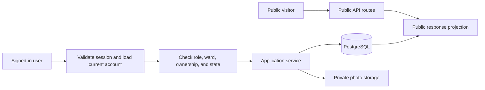
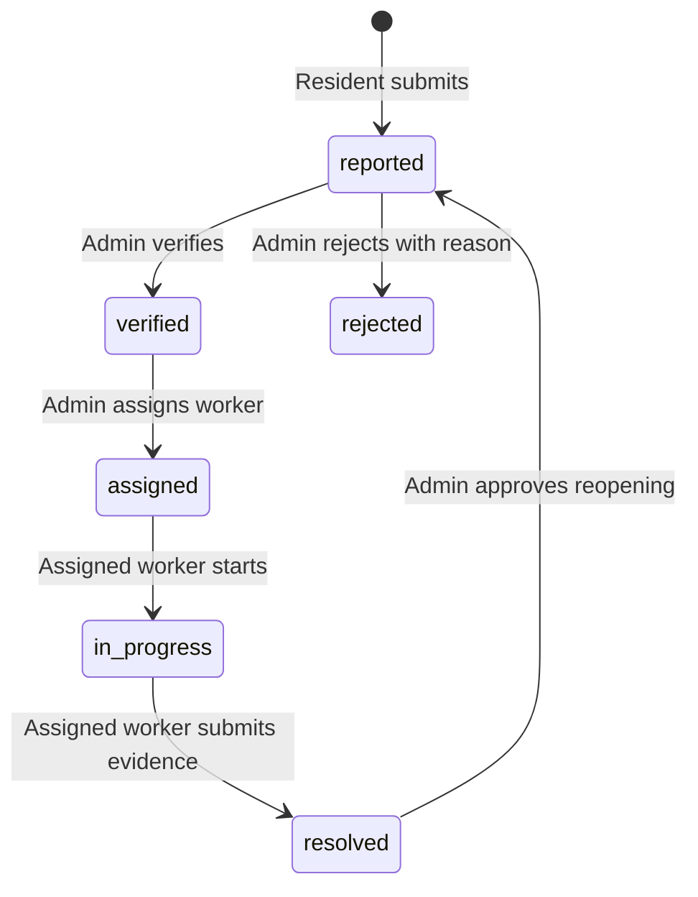

# DubsiBhai — Core API Low-Level Design

Related: [system overview](SYSTEM_DESIGN.md), [ML design](ML_SERVICE_DESIGN.md), [UI design](UI_DESIGN.md).

## 1. Scope and implementation status

This document defines the proposed implementation for `apps/api`. Currently the API has a
FastAPI application, CORS configuration, root endpoint, and health endpoints. Authentication,
database models, complaint workflows, storage, and ML integration described below are **planned**.

The decisions below resolve alternatives in the earlier system overview: manual verification,
resident-only public registration, explicit ward/super-admin roles, and API-owned persistence
of ML results. Use these three detailed design documents together when implementing features.
`API_CONTRACTS.md` should later capture the implemented request/response schemas and OpenAPI details.

## 2. People and access boundaries

There are **five human user types**, of which **four are authenticated account roles**.
An anonymous visitor has no database role. The ML service and background worker are system
identities, not human users.

| Type | Account role | Purpose | Data scope |
| --- | --- | --- | --- |
| Public visitor | None | Explore verified reports, public status history, and aggregate hotspots | Public projections only |
| Resident | `resident` | Submit complaints and follow their resolution | Public information plus their own full complaints |
| Municipal worker | `worker` | Work on assigned complaints and provide resolution evidence | Active assignments and permitted work history |
| Ward administrator | `ward_admin` | Verify reports, assign workers, review duplicates, and monitor progress | Assigned ward only |
| Super administrator | `super_admin` | Manage staff, wards, system configuration, and city-wide operations | All wards, with audited privileged actions |

Initial accounts have one role. Staff roles do not automatically inherit resident-only actions.
Multiple-role accounts can be introduced later if needed. A ward admin and worker each have
a `ward_id`; the super admin has city-wide scope.

| Action | Visitor | Resident | Worker | Ward admin | Super admin |
| --- | --- | --- | --- | --- | --- |
| View public map and published complaint details | Yes | Yes | Yes | Yes | Yes |
| Submit a complaint | Sign in first | Yes | No | No | No |
| View unpublished complaint | No | Own | Assigned | Own ward | Any |
| Edit complaint text/location | No | Own, while `reported` | No | No | No |
| Verify/reject a complaint | No | No | No | Own ward | Any |
| Assign/reassign work | No | No | No | Own ward | Any |
| Start/resolve assigned work | No | No | Own active assignment | No | No |
| Reopen a resolved complaint | No | Request review | No | Own ward | Any |
| Review ML category/duplicate suggestions | No | No | Read relevant result | Own ward | Any |
| View operational analytics | No | No | Own workload | Own ward | City-wide |
| Create staff or change roles | No | No | No | No | Yes |
| Trigger classification retry | No | No | No | Own ward | Any |
| Trigger city-wide clustering | No | No | No | No | Yes |

Every authorization check combines role, resource ownership/assignment, ward, and current state.
Never trust a submitted `reporter_id`, role, ward, or worker identity as authorization evidence.

## 3. Public versus authenticated requests

Public routes query explicitly published records; they never reuse a private ORM serialization.
A new `reported` complaint stays private until an administrator verifies it. Verified, assigned,
in-progress, and resolved complaints can be public unless an administrator hides them.
Rejected reports remain visible only to their owner and authorized staff.

Public fields: complaint ID, moderated summary, ward, approved category, severity, status,
approximate map position, timestamps, public timeline, and explicitly approved photos.
Exclude reporter identity, contact details, exact private location, internal notes, raw ML text,
embeddings, storage keys, and staff personal details. Keep publication separate from workflow state
using `is_public` and `public_summary`; verification is an opportunity to redact identifying text.
Public photos require a separate approval flag and stripped metadata. Publish rounded coordinates
at approximately a 100-metre scale; do not expose precise coordinates through a second GeoJSON route.

## 4. Authentication and account lifecycle

1. Public registration creates an active `resident` only. Reject attempts to supply privileged roles.
2. Store a password hash, never plaintext. Validate normalized unique login identifiers.
3. Login issues a short-lived access JWT and a rotating refresh session. Initial proposed lifetimes
   are 15 minutes and 7 days; keep these configurable.
4. For the browser, use HttpOnly cookies. Use Secure cookies on deployed HTTPS, SameSite protection,
   and validated Origin plus CSRF tokens on unsafe methods. Permit only configured frontend origins
   with credentials. The localhost exception is development-only.
5. The JWT identifies the user/session. Dependencies reload account activity, role, and ward from
   the database so disabled accounts and changed privileges take effect without waiting for expiry.
6. Store refresh-token hashes and revocation state. Rotate on refresh; revoke on logout and account
   disablement. The frontend may refresh once after an expired session, then requires sign-in.
7. Staff accounts are provisioned by the super admin through an invitation/password-setup flow.
   Create the first super admin through a controlled bootstrap command, never public registration.

Rate-limit login, registration, and public queries. Password reset and contact verification are
later account features; they must not create a second path to grant privileged roles.

## 5. Module responsibilities

| Module | Responsibility |
| --- | --- |
| `core/config.py` | Environment settings and allowed origins |
| `core/security.py` | Password hashing, JWT validation, token/session helpers |
| `core/dependencies.py` | Current account, active-account checks, role and scope guards |
| `models/` | ORM models, constraints, relationships |
| `schemas/` | Distinct public/private requests and response schemas |
| `api/v1/auth.py` | Register, login, refresh, logout, current profile |
| `api/v1/complaints.py` | Scoped reads, submission, edits, transitions, publication |
| `api/v1/assignments.py` | Assignment and reassignment endpoints |
| `api/v1/map.py` | Bounded public GeoJSON queries |
| `api/v1/analytics.py` | Ward-scoped and city-wide aggregates |
| `api/v1/admin.py` | Staff, wards, audit access, ML retry requests |
| `services/complaint_service.py` | Transactional complaint lifecycle and authorization rules |
| `services/assignment_service.py` | Worker eligibility, one active assignment, reassignment |
| `services/storage_service.py` | Upload validation, object references, signed private access |
| `services/ml_client.py` | Typed internal HTTP client; timeouts and response validation |
| `workers/classify_consumer.py` | Consume classification jobs, call ML, persist results |
| `db/session.py` | Database sessions and transaction boundaries |

Routers parse requests, call dependencies/services, and serialize responses. Services enforce business
rules and transactions. UI checks complement these rules but never replace API authorization.

## 6. Persistence model

| Entity | Key fields and constraints |
| --- | --- |
| `users` | UUID, login identifier, password hash, role, nullable ward ID, active flag, timestamps |
| `wards` | ID, name, authoritative geographic boundary |
| `refresh_sessions` | User ID, hashed token, expiry, revoked timestamp, token family |
| `complaints` | Reporter ID, text, exact location, ward ID, status, severity, revision, approved category, publication fields |
| `complaint_photos` | Complaint ID, private object key, uploader, purpose, approval flag |
| `assignments` | Complaint ID, worker ID, assigning admin, assigned/closed timestamps; one active per complaint |
| `status_updates` | Complaint ID, actor, previous/next status, public note, internal note, timestamp |
| `complaint_ml_results` | Complaint ID, text revision, model version, prediction, probabilities, source, timestamp |
| `ml_jobs` | Job UUID, complaint ID/revision, queued/processing/succeeded/failed state, attempts, last error |
| `outbox_events` | Event/job ID, payload version, payload, dispatched timestamp |
| `complaint_clusters` | Future cluster summaries and versioned membership |
| `audit_events` | Actor, action, target, request ID, timestamp, relevant non-secret changes |

Use foreign keys, bounded status/role values, and timestamps in UTC. Index complaint status/ward/time,
reporter, active worker assignments, and locations. Derive ward from authoritative boundaries;
do not accept a resident's ward selection as final. Keep migration ownership with the core API.

## 7. Proposed route inventory

All routes below are planned and prefixed `/api/v1`. Only health routes are currently implemented.

| Method and route | Access | Result or operation |
| --- | --- | --- |
| `GET /public/complaints` | Public | Paginated, filtered published summaries |
| `GET /public/complaints/{id}` | Public | Redacted detail and public timeline |
| `GET /map/complaints` | Public | Published, bounded GeoJSON features |
| `GET /map/clusters` | Public | Aggregate hotspots, when implemented |
| `POST /auth/register`, `POST /auth/login` | Public | Resident registration and login |
| `POST /auth/refresh`, `POST /auth/logout` | Session cookie | Rotate or revoke session |
| `GET /auth/me` | Signed in | Role, ward, and current profile |
| `POST /complaints` | Resident | Create report; return `201` with `ml_status: queued` |
| `GET /complaints` | Signed in | Server-scoped list for owner, assignee, or admin |
| `GET /complaints/{id}` | Scoped account | Private detail appropriate to role |
| `PATCH /complaints/{id}` | Owner while reported | Edit content; increment revision and requeue ML |
| `POST /complaints/{id}/photos` | Owner while reported or active worker | Validated complaint/evidence upload |
| `PATCH /complaints/{id}/status` | Authorized worker/admin | Valid state transition with reason/evidence |
| `PATCH /complaints/{id}/publication` | Scoped admin | Publish/redact/hide public content |
| `PATCH /complaints/{id}/category` | Scoped admin | Confirm or override ML suggestion |
| `POST /complaints/{id}/reopen-request` | Owner of resolved report | Request admin review; no automatic transition |
| `POST /assignments` | Scoped admin | Assign an eligible worker |
| `PATCH /assignments/{id}` | Scoped admin | Close/reassign current work with audit |
| `GET /analytics/ward/{id}` | Ward admin for same ward, super admin | Operational summary |
| `GET /analytics/city` | Super admin | City-wide summary |
| `POST /admin/users`, `PATCH /admin/users/{id}` | Super admin | Staff provisioning, role/scope/activity changes |
| `POST /complaints/{id}/ml-retry` | Scoped admin | Queue classification, return `202` |
| `POST /admin/clustering-runs` | Super admin | Future batch clustering request |

Initial proposed bounds: text 1–5000 characters; page size default 20/max 100; photos max 5 per
complaint, 5 MB each, decoded JPEG/PNG/WebP only. Configure bounds centrally and show them in the UI.
Map requests require viewport bounds and capped features; dense results should use aggregation.
Upload in a separate endpoint so photo failure does not duplicate complaint creation. Validate actual
image content, strip metadata, and clean up orphaned storage objects after failed transactions.

## 8. Complaint workflow and transaction rules

| Transition | Required checks |
| --- | --- |
| Reported → verified/rejected | Admin ward scope; public redaction on verification; rejection reason |
| Verified → assigned | Active worker in same ward; no active assignment already present |
| Assigned → in progress | Actor is the currently assigned worker |
| In progress → resolved | Resolution note and at least one evidence photo; close active assignment |
| Resolved → reported | Admin approves reopening with reason; archive previous assignment; queue current revision |

Reassignment closes the old assignment and creates the new one atomically. An in-progress report
returns to `assigned` for its new worker with a logged transition. Concurrent changes use a revision
check or row lock; return `409` for stale updates. Each transition writes its history and audit entry
in the same transaction. No direct assignment to arbitrary status strings is allowed.

Submission transaction: create complaint, ML job, and outbox event, then commit before returning.
An outbox dispatcher publishes to Redis after commit and retries publication failure. Classification
never changes complaint workflow status, severity, publication, or an admin-approved category.
Its suggestion is stored separately. See the [ML design](ML_SERVICE_DESIGN.md) for job handling.

## 9. Errors, privacy, and acceptance checks

Use `401` for a missing/expired session, `403` for a disallowed role, `404` for unavailable or
out-of-scope resource IDs, `409` for state conflicts, `413` for oversized uploads, `422` for invalid
input, and `429` for request limits. Include a request ID and safe error text; do not expose stack traces.
Keep credentials and complaint text out of routine logs. Authenticated responses are not publicly cached.

Required implementation tests:

- Anonymous users cannot mutate data or retrieve private fields through detail, list, or map routes.
- A resident cannot register as staff or retrieve another resident's unpublished complaint.
- A worker cannot act on another worker's assignment; a ward admin cannot cross ward boundaries.
- Disabled accounts and revoked sessions cannot act, including with a previously issued JWT.
- Invalid transitions and competing assignments fail without partial writes.
- Complaint submission succeeds while Redis or ML is unavailable; outbox work is recoverable.
- Duplicate/stale ML results cannot overwrite a current revision or human decision.

Suggested implementation order: persistence and migrations → authentication/scope checks → private
complaint CRUD → moderation and public projections → assignment/status history → background ML
integration → operational analytics. Comments, upvotes, SMS, and advanced staff workflows are later scope.
