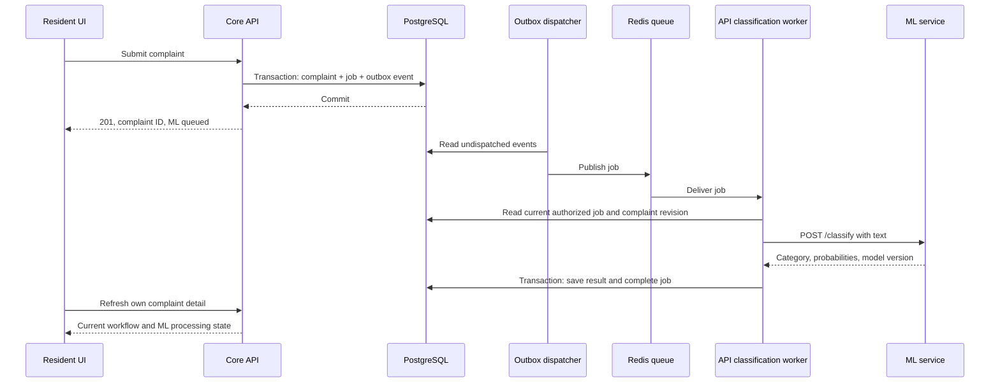

# DubsiBhai — ML Service Design and API Integration

Related: [API design](API_LOW_LEVEL_DESIGN.md), [UI design](UI_DESIGN.md),
[training/run instructions](../apps/ml-service/README.md).

## 1. Current capability versus planned work

| Capability | Status |
| --- | --- |
| Bengali category classifier, saved artifact, explicit retraining CLI | Implemented |
| `POST /classify`, `GET /model`, `/health`, `/ready` | Implemented |
| Synthetic CSV validation, deduplication, holdout report, notebook | Implemented |
| Core API invoking ML, Redis jobs, persistence of results | Planned |
| Service authentication and network isolation for deployment | Planned |
| Semantic embeddings and duplicate suggestions | Planned; current `embedder.py` is a placeholder |
| Geographic hotspot clustering | Planned; current `clustering.py` is a placeholder |

The current classifier does not detect duplicates, choose severity, verify reports, assign workers,
or train itself from incoming complaints. It predicts a category and returns model probabilities.

## 2. Responsibility and ownership decisions

The core API owns human authentication, complaints, photos, workflow states, publication, and
durable ML result records. The ML service owns training artifacts, feature extraction, and inference.
The browser talks to the core API only; it does not call ML directly or receive internal credentials.

**Initial integration decision:** an API-owned background worker consumes classification jobs and
calls the existing ML HTTP endpoint. The worker persists results using the API's database layer.
The ML service initially has no PostgreSQL credentials, Redis consumer, or photo-storage access.

This deliberately chooses one path from the alternatives in the earlier overview. The earlier
ML-owned table writes, ML-side Redis consumer, and `/internal/ml-callback` sketch are **not required
for this initial integration**. Do not implement both delivery paths. A later change to callback
delivery or ML-owned storage requires a separate architecture decision and updated contracts.

## 3. Service modules

| Location | Responsibility |
| --- | --- |
| `app/train.py` | Validate dataset, evaluate pipeline, refit, save artifact/report |
| `app/models/classifier.py` | Text normalization, pipeline construction, artifact loading, prediction |
| `app/core/config.py` | `ML_` environment settings and model path |
| `app/main.py` | Load one model per application process during startup |
| `app/api/classify.py` | Validate inference requests and expose model metadata |
| `app/api/health.py` | Separate process liveness from classifier readiness |
| `weights/` | Local gitignored model artifact and training report |
| `train.ps1` | Explicit reproducible training entry point |
| `notebooks/classifier_experiments.ipynb` | Manual examples, probability inspection, stored evaluation |
| `tests/` | Dataset validation, model round trip, API behavior, unavailable artifacts |

Use the service's locked Python environment for training, serving, and notebooks. Each serving
process loads its own artifact once. Model replacement takes effect only after a restart.

## 4. Training lifecycle

```mermaid
flowchart LR
    CSV[UTF-8 labeled CSV] --> Validate[Validate IDs, labels, text]
    Validate --> Normalize[NFC and whitespace normalization]
    Normalize --> Dedup[Remove exact normalized duplicates]
    Dedup --> Split[Stratified holdout]
    Split --> Fit[Fit features and classifier on training split]
    Fit --> Evaluate[Evaluate held-out examples]
    Evaluate --> Refit[Refit on all unique examples]
    Refit --> Artifact[Versioned artifact and report]
    Artifact --> Restart[Restart service and load model]
```



Input columns are `id,text_bn,category`. IDs must be nonempty and unique, text must contain
1–5000 characters, and categories must be one of:

| Category | Meaning |
| --- | --- |
| `blocked_drain` | Drain blocked by waste or debris |
| `open_manhole` | Open or missing manhole cover |
| `road_flooding` | Acute road flooding |
| `waterlogging_recurring` | Repeated/chronic waterlogging |
| `sewage_overflow` | Sewage escaping onto streets or surrounding areas |
| `other` | Remaining labeled drainage complaints |

Current pipeline: character TF-IDF, 2–5-character n-grams, sublinear term frequency, and balanced
logistic regression. Character features preserve Bengali marks without a separate word tokenizer.
Reject conflicting labels for duplicate texts. Require sufficient distinct examples to represent
every category in both evaluation splits. The normal split is 80/20 with seed 42.

The report records source type (`synthetic`, `real`, or `mixed`), dataset hash, row counts, category
counts, model/sklearn versions, accuracy, macro F1, per-class metrics, and a confusion matrix.
Evaluation fits features on the training split only. The final serving refit uses all unique rows;
the holdout scores describe the earlier evaluation model.

Initial dataset: 360 rows, 295 distinct texts, 65 duplicates removed. Initial holdout: 236 training
and 59 test examples, approximately 98.3% accuracy. Shared synthetic templates make this an
integration baseline, not evidence of real-world performance. Confidence is not calibrated, and
`other` is a learned category rather than a reliable unknown-input detector.

To replace data, retain the schema/category names and run `./train.ps1 -DataSource real` inside
`apps/ml-service`, or pass `-Dataset` for another CSV. Inspect the report, then restart the service.
Use a separately collected real evaluation set before deployment decisions; do not silently treat
model-generated labels as ground truth. Preserve the previous artifact before an intentional
promotion so rollback is possible. Only load trusted artifacts; joblib deserialization executes code.

## 5. Existing HTTP contract

`POST /classify` currently accepts:

```json
{"text": "ম্যানহোলের ঢাকনা নেই, বাচ্চারা পড়ে যেতে পারে।"}
```

Its response contains:

```json
{
  "predicted_category": "open_manhole",
  "confidence": 0.8068173737944686,
  "probabilities": {
    "blocked_drain": 0.03767390549951383,
    "open_manhole": 0.8068173737944686,
    "other": 0.03813616023576267,
    "road_flooding": 0.03992531041117315,
    "sewage_overflow": 0.04285557550329673,
    "waterlogging_recurring": 0.03459167455578496
  },
  "model_version": "20260925T202213758971Z-b958a49536db",
  "data_source": "synthetic"
}
```

The response above is an example, not a fixed expected confidence. Blank/missing/oversized text
returns `422`; an unavailable classifier returns `503`. `/health` reports process liveness even
without a model; `/ready` returns `503` until one is loaded. `/model` exposes training metadata.
Complaint IDs, geographic coordinates, and job IDs are not required by today's `/classify` request.

## 6. Planned complaint-to-classification flow



Proposed queue envelope, separate from the ML HTTP body:

```json
{
  "schema_version": 1,
  "job_id": "uuid",
  "complaint_id": "uuid",
  "complaint_revision": 1,
  "operation": "classify",
  "request_id": "uuid"
}
```

The worker retrieves text from the API-owned database, verifies the revision, and sends only
`{"text": "..."}` to ML. It validates known category names, finite bounded probabilities, their
sum within tolerance, and model metadata before saving. Persist `job_id`, complaint revision,
model version, and processing timestamps. Keep predictions separate from a human-approved category.

## 7. Reliability and internal access

Proposed initial worker settings: 2-second connection timeout, 15-second response timeout,
and three total attempts with delayed retries (5 then 30 seconds). Tune from measured latency.
Retry transport failures, `429`, and transient `5xx`; fail invalid requests/responses for inspection.
After exhaustion, mark the job failed and allow a scoped admin retry. The complaint remains usable.

Redis delivery may occur more than once. Use a durable job ID, a unique result/job relationship,
and a transactional claim/lease so retries cannot produce duplicate effective writes. Reclaim jobs
whose worker lease expired. A crash after saving but before acknowledging the queue must be harmless.
Outbox dispatch can also repeat; the same job ID is reused.

When text changes, increment complaint revision and queue a new job. Skip older jobs before inference
and check the revision again before saving. Discard results from older revisions. Coalesce duplicate
retry requests for the same active revision; never let a late result undo an administrator's category.

Deployed ML routes should be private and require a service credential separate from user JWTs.
The API worker supplies it from environment configuration; browsers never receive it. Restrict
`/model` and operational details to internal callers. These controls are planned; the current service
is a local development service bound to loopback by `run.ps1`.

Record job/request IDs, duration, attempts, outcome, and model version. Do not log raw complaints
or credentials. Monitor queue age, error rate, readiness, class distribution, and reviewed corrections.

## 8. Future duplicate detection and clustering

Duplicate detection needs complaint IDs, timestamps, geographic coordinates, and a candidate corpus,
which the category CSV does not supply. A future embedder produces compatible versioned embeddings;
the API queries pgvector and PostGIS for candidates within configurable distance and time bounds.
Return candidate IDs and similarity evidence to administrators. Never automatically merge complaints.
Embedding-model changes require a versioned index and re-embedding strategy.

Hotspot clustering needs a geospatial history of complaints. A future batch job builds a snapshot
of eligible coordinates/timestamps, runs DBSCAN using an appropriate geographic distance treatment,
and returns memberships and summaries. The API persists results and serves aggregated public overlays.
Publish a completed run atomically so the UI does not combine partial generations. Define recurrence
thresholds from observed time windows; complaint count alone does not establish chronic recurrence.

Proposed `/check-duplicate` and `/run-clustering` contracts will be designed when those datasets and
algorithms exist. Do not present these endpoints or map layers as working today.

## 9. Integration acceptance criteria

- Current classifier output is available through a running service and is tied to a model version.
- Missing/incompatible artifacts cause readiness/classification failure without false success.
- Complaint submission remains successful during ML/Redis outages, with recoverable jobs.
- Replayed jobs and stale revisions cannot replace current results or human decisions.
- Unauthorized callers cannot invoke deployed inference or view model metadata.
- A real-data retraining run can be evaluated, promoted, restarted, and rolled back independently
  of the frontend, while preserving the response schema.
