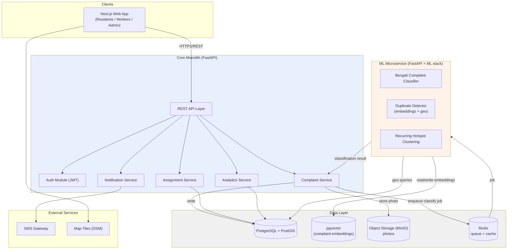
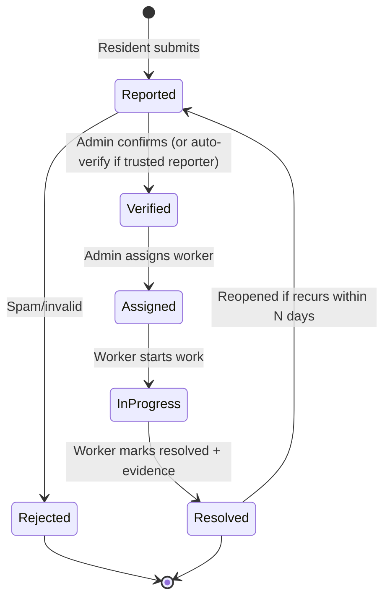
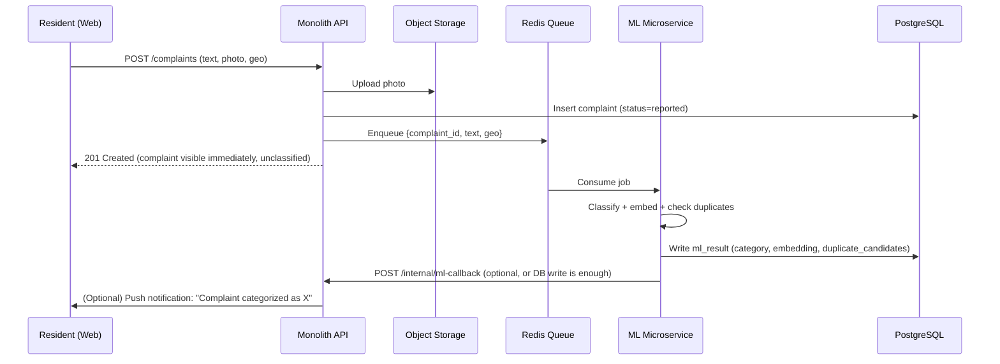
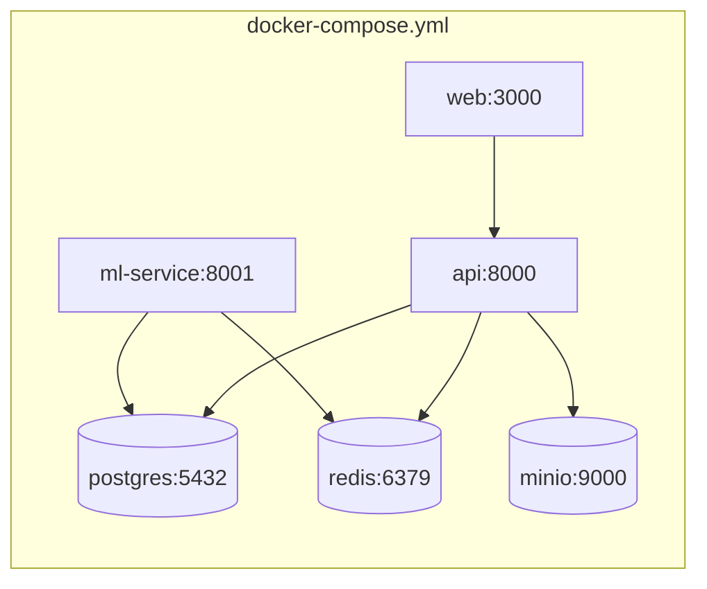

# DubsiBhai — System Design

**Urban Waterlogging & Drainage Management for Dhaka** Architecture: Monolith (core application) + separate ML microservice (Bengali NLP)

---

## 1. Overview

DubsiBhai lets residents report waterlogged roads and blocked drains with photos and geolocation, lets municipal workers manage and resolve those reports, and lets the public track resolution progress on a live map. A separate ML service handles Bengali complaint classification, duplicate detection, and geographic clustering of recurring problem spots.

### 1.1 Why monolith + separate ML service (not full microservices)

| Concern | Reasoning |
| --- | --- |
| Team size | Solo/small-team lab project — a distributed microservices architecture adds ops overhead with no payoff at this scale |
| Core app needs | CRUD, auth, file upload, notifications — all naturally cohesive, no reason to split |
| ML service needs | Different runtime (Python ML stack: transformers/sklearn/spaCy or a Bengali BERT variant), different scaling profile (CPU/GPU-bound batch work vs. request/response CRUD), different deploy cadence (model updates shouldn't require redeploying the whole app) |
| Fault isolation | If the ML service crashes or is slow, complaint submission still works — classification just runs later/async |
| Grading/demo | Clean separation is easy to explain in a viva: "core app" vs. "AI service" as two clearly distinct, defensible components |

This is a well-justified split, not premature microservice fragmentation — you have exactly one real reason to separate a service (heterogeneous runtime + independent scaling), which is the right threshold.

---

## 2. High-Level Architecture



**Communication pattern between monolith and ML service:**

- **Async (primary)**: Monolith pushes a job to a Redis queue on complaint creation → ML service consumes, classifies, detects duplicates, writes results back via a callback API on the monolith (or directly to a shared `ml_results` table). This keeps complaint submission fast even if the model is slow.
- **Sync (secondary, optional)**: A direct REST call (`POST /classify`) for on-demand re-classification or admin-triggered clustering runs.

---

## 3. Core Entities & Data Model

```mermaid
erDiagram
    USER ||--o{ COMPLAINT : files
    USER ||--o{ ASSIGNMENT : "assigned as worker"
    COMPLAINT ||--o{ COMPLAINT_PHOTO : has
    COMPLAINT ||--o{ STATUS_UPDATE : has
    COMPLAINT ||--o| ASSIGNMENT : "has one active"
    COMPLAINT }o--o{ COMPLAINT_CLUSTER : "belongs to"
    COMPLAINT ||--o| COMPLAINT_ML_RESULT : "has one"

    USER {
        uuid id PK
        string name
        string phone
        string email
        enum role "resident, worker, admin"
        geography home_area
        timestamp created_at
    }

    COMPLAINT {
        uuid id PK
        uuid reporter_id FK
        string description_bn
        geography location
        string ward
        enum severity "low, medium, high, critical"
        enum status "reported, verified, assigned, in_progress, resolved, rejected"
        uuid duplicate_of FK "nullable, self-ref"
        timestamp created_at
        timestamp updated_at
    }

    COMPLAINT_PHOTO {
        uuid id PK
        uuid complaint_id FK
        string s3_key
        timestamp uploaded_at
    }

    ASSIGNMENT {
        uuid id PK
        uuid complaint_id FK
        uuid worker_id FK
        timestamp assigned_at
        timestamp resolved_at
        text resolution_notes
    }

    STATUS_UPDATE {
        uuid id PK
        uuid complaint_id FK
        uuid updated_by FK
        enum old_status
        enum new_status
        text note
        timestamp created_at
    }

    COMPLAINT_ML_RESULT {
        uuid complaint_id PK_FK
        string predicted_category
        float confidence
        vector embedding "pgvector"
        uuid[] duplicate_candidates
        timestamp processed_at
    }

    COMPLAINT_CLUSTER {
        uuid id PK
        geography centroid
        int complaint_count
        string ward
        enum recurrence_level "occasional, recurring, chronic"
        timestamp last_updated
    }
```

---

## 4. Monolith — Module Breakdown (FastAPI)

```
apps/api/
├── app/
│   ├── main.py
│   ├── core/
│   │   ├── config.py
│   │   ├── security.py          # JWT, password hashing
│   │   └── dependencies.py      # role-based access control
│   ├── models/                  # SQLAlchemy models
│   │   ├── user.py
│   │   ├── complaint.py
│   │   ├── assignment.py
│   │   └── cluster.py
│   ├── schemas/                 # Pydantic request/response schemas
│   ├── api/
│   │   ├── v1/
│   │   │   ├── auth.py
│   │   │   ├── complaints.py
│   │   │   ├── assignments.py
│   │   │   ├── map.py            # geo query endpoints
│   │   │   ├── analytics.py
│   │   │   └── admin.py
│   ├── services/
│   │   ├── complaint_service.py
│   │   ├── assignment_service.py
│   │   ├── notification_service.py
│   │   ├── storage_service.py    # MinIO/S3 upload
│   │   └── ml_client.py          # HTTP client to ML microservice
│   ├── workers/
│   │   └── classify_consumer.py  # Redis queue consumer, calls ML service
│   └── db/
│       ├── session.py
│       └── migrations/           # Alembic
├── tests/
├── Dockerfile
└── requirements.txt
```

### 4.1 Role-Based Access Control (RBAC)

| Role | Permissions |
| --- | --- |
| **Resident** | Submit complaints, view own complaints, view public map, comment/upvote |
| **Worker** | View assigned complaints, update status, add resolution notes/photos |
| **Ward Admin** | Assign workers, verify/reject complaints, view ward analytics |
| **Super Admin** | Full access, manage users, view city-wide analytics, trigger clustering runs |

---

## 5. ML Microservice — Module Breakdown

```
apps/ml-service/
├── app/
│   ├── main.py
│   ├── models/
│   │   ├── classifier.py         # Bengali text classification
│   │   ├── embedder.py           # sentence embeddings for dedup
│   │   └── clustering.py         # DBSCAN/HDBSCAN on geo + text
│   ├── api/
│   │   ├── classify.py           # POST /classify
│   │   ├── dedup.py              # POST /check-duplicate
│   │   └── cluster.py            # POST /run-clustering (batch job)
│   ├── consumers/
│   │   └── queue_consumer.py     # Redis job consumer
│   └── weights/                  # cached/fine-tuned model files
├── Dockerfile
└── requirements.txt
```

### 5.1 ML Pipeline Detail

**a) Bengali Complaint Classification**

- Input: `description_bn` (free-text Bengali complaint)
- Approach: Fine-tune or use a pretrained Bengali transformer (e.g., `sagorsarker/bangla-bert-base` or `csebuetnlp/banglabert`, both free on HuggingFace) for multi-class classification into categories: *blocked drain, open manhole, road flooding, waterlogging-recurring, sewage overflow, other*.
- Fallback for lab scope: TF-IDF + a classical classifier (Logistic Regression/SVM) trained on a small labeled sample if fine-tuning a transformer is too heavy for your timeline — still legitimate and demoable.

**b) Duplicate Detection**

- Generate a sentence embedding for each complaint (multilingual sentence-transformer, e.g. `paraphrase-multilingual-MiniLM-L12-v2`, free).
- Store in `pgvector`.
- On new complaint: query `pgvector` for nearest neighbors within embedding-distance threshold **AND** within a geo-radius (e.g. 100m via PostGIS `ST_DWithin`) **AND** within a time window (e.g. 14 days) → flag as candidate duplicate for admin review (never auto-merge — human confirms).

**c) Recurring Hotspot Clustering**

- Periodic batch job (e.g. nightly, via cron or Celery beat):
  - Cluster resolved+reported complaints geographically using DBSCAN (handles irregular cluster shapes and doesn't require specifying cluster count upfront — good fit for organic waterlogging hotspots).
  - For each cluster, count recurrence over time → classify as `occasional` / `recurring` / `chronic`.
  - Write to `complaint_cluster` table → surfaced on the public map as heatmap overlays.

---

## 6. Key API Endpoints (Monolith)

| Method | Endpoint | Description |
| --- | --- | --- |
| POST | `/api/v1/auth/register` | Resident/worker registration |
| POST | `/api/v1/auth/login` | JWT login |
| POST | `/api/v1/complaints` | Submit new complaint (photo + geo + text) |
| GET | `/api/v1/complaints` | List/filter complaints (by ward, status, severity) |
| GET | `/api/v1/complaints/{id}` | Complaint detail + status history |
| PATCH | `/api/v1/complaints/{id}/status` | Worker/admin updates status |
| POST | `/api/v1/assignments` | Admin assigns worker to complaint |
| GET | `/api/v1/map/complaints` | GeoJSON feed for map rendering |
| GET | `/api/v1/map/clusters` | Recurring hotspot overlay data |
| GET | `/api/v1/analytics/ward/{ward_id}` | Ward-level resolution stats |
| POST | `/api/v1/internal/ml-callback` | ML service posts classification/dedup results back |

## 7. Key API Endpoints (ML Service)

| Method | Endpoint | Description |
| --- | --- | --- |
| POST | `/classify` | Classify Bengali complaint text into category |
| POST | `/check-duplicate` | Given embedding + geo, return candidate duplicate complaint IDs |
| POST | `/run-clustering` | Trigger a clustering batch run (admin-only, called by monolith) |
| GET | `/health` | Health check for monitoring |

---

## 8. Complaint Lifecycle (State Machine)



---

## 9. Async Processing Flow (Complaint Submission → Classification)



This decouples user-facing latency from ML inference time — the resident sees their complaint immediately; classification happens within seconds to a few minutes.

---

## 10. Tech Stack Summary

| Layer | Technology | Notes |
| --- | --- | --- |
| Frontend | Next.js + Tailwind | Map via Leaflet + OSM tiles (free) |
| Core API | FastAPI | Monolith, modular by domain |
| ML Service | FastAPI + HuggingFace Transformers / scikit-learn | Separate container, separate repo or subdir |
| Database | PostgreSQL + PostGIS extension | Geo queries (radius search, clustering) |
| Vector store | pgvector (extension on same Postgres) | No need for a separate vector DB at this scale |
| Queue | Redis (+ RQ or Celery) | Decouples monolith from ML service |
| Object storage | MinIO (self-hosted, S3-compatible, free) | Complaint photos |
| Auth | JWT (FastAPI + python-jose) | Role-based access |
| Notifications | SMS gateway (e.g. a free-tier BD SMS API) or just email for MVP |  |
| Deployment | Docker Compose | One compose file, 6 services: web, api, ml, postgres, redis, minio |

---

## 11. Docker Compose Topology



Each service gets its own `Dockerfile`; the ML service's image will be notably larger (transformer weights) — worth noting in your report as a real tradeoff of the split (independent image size/build time, doesn't bloat the core API image).

---

## 12. Suggested Build Order (for a semester-length lab)

1. **Weeks 1–2**: Auth + complaint CRUD + photo upload (monolith only, no ML yet)
2. **Weeks 3–4**: Map view (Leaflet + GeoJSON endpoint), status workflow, assignment flow
3. **Weeks 5–6**: Stand up ML service skeleton, wire Redis queue, get classification working end-to-end (even with the simple TF-IDF fallback first)
4. **Weeks 7–8**: Duplicate detection via pgvector + geo filtering
5. **Weeks 9–10**: Clustering job + hotspot overlay on map, analytics dashboard
6. **Weeks 11–12**: Polish, notifications, admin panel, deployment, report writing

---

## 13. Scope Notes / Things to Decide Early

- **Auto-verify vs. manual verify**: decide whether new complaints go straight to "Verified" or need admin approval first — affects your state machine and admin workload in the demo.
- **Duplicate handling**: recommend *never* auto-merging duplicates — always surface as a suggestion for a human (admin/worker) to confirm, to avoid silently hiding real distinct issues.
- **Bengali text data for training**: you'll need some labeled sample complaints to fine-tune/evaluate the classifier — consider scraping/adapting from public Dhaka waterlogging news reports or generating a synthetic labeled set for the lab (call this out honestly in your report, same as any lab assignment where a real dataset isn't available).