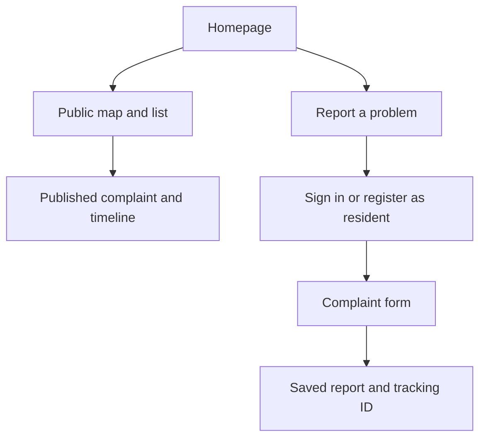

# DubsiBhai — UI and User Flow Design

Related: [API and roles](API_LOW_LEVEL_DESIGN.md), [ML integration](ML_SERVICE_DESIGN.md),
[system overview](SYSTEM_DESIGN.md).

## 1. Scope and current state

The frontend lives in `apps/web` and uses Next.js App Router, TypeScript, and Tailwind CSS.
It currently contains a starter homepage and coming-soon pages for map, complaint detail, login,
registration, worker dashboard, and admin dashboard. The flows below are **planned**, not existing
authentication, maps, or operational dashboards.

Design for Bengali-speaking residents on mobile connections, plus staff doing repeated operational
work on desktop or mobile. Use readable Bengali typography, descriptive labels, and a consistent
Bengali/English terminology map. The UI communicates observable complaint progress; it does not
present ML predictions as verified municipal decisions.

## 2. Navigation by user type

| User | Primary navigation | Landing page after sign-in |
| --- | --- | --- |
| Public visitor | Home, Map, Report a problem, Sign in | Not applicable |
| Resident | Map, Report a problem, My complaints, Account | `/my-complaints` |
| Worker | My assignments, Work history, Account | `/worker` |
| Ward admin | Review queue, Complaints, Assignments, Ward analytics | `/admin` |
| Super admin | City overview, Complaints, Wards, Staff, ML operations | `/super-admin` |

All account roles may browse the public map. Staff actions are limited to the API permission matrix.
Hidden navigation items are a convenience, not an authorization boundary. Every sensitive API request
must enforce role, ward, ownership, and workflow state independently.

## 3. Route and API mapping

Route groups organize code and do not appear in URLs. Existing pages may be moved into more suitable
groups when implementing authenticated areas. Endpoints below are proposed unless marked current.

| Browser route | Access | Main data/actions |
| --- | --- | --- |
| `/` | Public | Introduction, map link, report CTA |
| `/map` | Public | `GET /api/v1/map/complaints`; future aggregate clusters |
| `/complaints/[id]` | Public | `GET /api/v1/public/complaints/{id}`; published projection only |
| `/login`, `/register` | Public | API login and resident-only registration |
| `/report` | Resident | Create complaint, then upload photos |
| `/my-complaints` | Resident | `GET /api/v1/complaints` scoped to owner |
| `/my-complaints/[id]` | Owning resident | Private detail, reported-stage edits, reopening request |
| `/worker` | Worker | Scoped active assignments and workload |
| `/worker/complaints/[id]` | Assigned worker | Private work detail, start work, resolution evidence |
| `/admin` | Ward admin | Ward review queue and summary |
| `/admin/complaints/[id]` | Ward admin, same ward | Verify/reject, publish/redact, category/duplicate review, assign |
| `/admin/analytics` | Ward admin | Ward analytics |
| `/super-admin` | Super admin | City-wide operations and cross-ward filters |
| `/super-admin/users` | Super admin | Create staff, assign roles/wards, deactivate accounts |
| `/super-admin/ml` | Super admin | API-provided job health, retries, future clustering runs |
| `/account` | Signed in | Current profile and logout |

The public detail route never conditionally becomes a private response. Use separate private
routes and API schemas to prevent sensitive data from entering public caches or shared page metadata.

## 4. Public visitor journey

Homepage: explain the project, show a clear report action, and offer map browsing without login.
Use actual approved aggregate data when available; show an empty state instead of invented counts.

Map: viewport search, ward/status/category filters, marker grouping, and an equivalent list view.
Debounce viewport changes, cancel stale fetches, and retain filter state in the URL. Explain that
locations are approximate. A selected item shows published category, status, summary, ward, and
last update; opening it displays the public timeline and approved photos.

No account is required to read public content. Selecting a write action requests sign-in and returns
to an allowlisted internal destination afterward. Unpublished, hidden, or unknown complaint IDs show
a neutral not-available page. Do not reveal whether a private record exists.

## 5. Resident journey

Registration requests only required identity/contact fields and a password; it has no role selector.
Login success loads `/auth/me` and routes the user by their server-issued role.

The report form is a short sequence:

1. **Describe:** Bengali complaint text with examples and a visible character limit.
2. **Locate:** request location permission after a user action; allow manual pin placement when denied.
   Show the selected area and explain that the public map uses an approximate position.
3. **Photos:** optional initial photos with preview/removal and visible type/count/size limits.
4. **Review and submit:** show the text, location, and chosen files before confirming.

Match API constraints: 1–5000 text characters, up to 5 photos, 5 MB each, JPEG/PNG/WebP.
Client checks improve feedback; the API revalidates content. Do not silently submit browser coordinates
without confirmation. The server determines the authoritative ward.

On submit, disable repeat clicks while the request is pending. Once creation returns a complaint ID,
retain it and upload photos against that record. A failed upload offers retry for the same complaint,
not a new submission. A lost create response must be reconciled before retrying; implement an
API-supported idempotency key before automatic creation retries.

Confirmation displays the tracking ID, `Reported — awaiting review`, and a link to private detail.
An ML delay does not block this confirmation. Do not claim that submission means verification or
that an emergency response is guaranteed.

My complaints shows status filters, last update, and a timeline. Owners can edit only while `reported`.
After resolution they can request reopening with a reason; the UI labels this as a request awaiting
admin review rather than immediately changing the complaint status.

## 6. Worker journey

The worker dashboard defaults to active assignments, ordered by priority and assignment time, with
cards showing ward, location, severity, and current state. Only fetch assigned records.

Work detail shows the complaint, precise work location, relevant photos, assignment information,
and an operational timeline. Actions are state-specific:

| Current state | Worker action | Feedback |
| --- | --- | --- |
| Assigned | Start work | Confirm transition to `in_progress` |
| In progress | Add resolution note and evidence, then resolve | Upload progress and final confirmation |
| Resolved | Read work history | No active mutation controls |
| Reassigned/unavailable | Return to assignments | Explain that the assignment changed |

Do not optimistically declare work resolved before the API confirms it. On a `409`, refresh the
record and explain the competing change without discarding an unsent note unnecessarily.

## 7. Administrator journeys

Ward admin dashboard contains a review queue, assignment backlog, in-progress work, and ward-level
summaries. The API determines ward scope; manipulating a URL/filter cannot widen it.

Review screen includes original private text, a separately editable public summary, photos with
publication controls, proposed category, workflow severity, and suggested actions. Require a reason
for rejection, category override, reassignment, or reopening. Verification and publication are explicit
decisions; warn if text or images contain personal information before publishing.

The assignment panel offers only active eligible workers in the same ward. Show current assignment
and workload where available. Confirm replacement and keep the old assignment visible in history.

Super admin screens add cross-ward filtering, staff provisioning, role/ward changes, account deactivation,
audit history, and ML job operations. Reuse complaint review components with city-wide permissions.
Destructive or privileged operations need a clear confirmation showing the account/report affected.

ML operations show safe API summaries, queue state, model version/source, failure counts, and retry
actions. They never expose service credentials or directly call `localhost:8001` from browser code.
Training remains an operator CLI/notebook task; there is no arbitrary artifact-upload UI in this phase.

## 8. ML display rules

| ML condition | Resident/public display | Staff display |
| --- | --- | --- |
| Queued/processing | Report saved; review pending | Classification pending |
| Succeeded, awaiting human category review | General review state; do not present category as verified | Suggested category, confidence, source, model version |
| Failed/unavailable | Report remains saved and trackable | Processing failed and authorized retry action |
| Category confirmed by admin | Approved category on permitted views | Approved category plus retained prediction/audit |
| Future duplicate candidate | No automatic merging message | Candidate comparison and explicit review decision |

Do not turn synthetic model confidence into a severity score or a verified badge. Staff views label
the current model as synthetic-trained. Public views use the approved category, not raw probabilities.

## 9. Frontend structure and state

| Area | Responsibility |
| --- | --- |
| `src/app/` | Routes, layouts, loading/error/not-found boundaries, role-specific navigation |
| `components/map/` | Client-rendered map, accessible list alternative, future hotspot layer |
| `components/complaints/` | Form, status badge, timeline, photo upload, staff review panels |
| `components/ui/` | Buttons, inputs, dialogs, tables, empty/error states |
| `lib/api-client.ts` | Configured API origin, typed requests, credentials, CSRF header, normalized errors |
| `lib/auth.ts` | Session refresh and current-user helpers; no client-side secrets |
| `hooks/` | Viewport fetching, upload progress, scoped polling, form helpers |
| `packages/shared-types/` | Future generated types based on the core API schema |

Fetch authenticated data with credentials and without shared public caching. Keep session cookies
HttpOnly; do not copy JWTs into browser local storage. Guard server-rendered/private routes and check
again on API requests. Clear account-specific caches on logout or account changes.

Use local form state for unsent input; keep filter state in search parameters. Initially refresh
pending complaint detail periodically (for example every 10 seconds while visible), stop on navigation
or terminal processing state, and back off after errors. Real-time sockets can be added later.

## 10. Required screen states and accessibility

Every data screen needs loading, empty, populated, error/retry, and permission/session-expired states.
Use text with status colors, associated form labels, visible keyboard focus, keyboard-operable dialogs,
and screen-reader announcements for validation/upload results. Preserve readable contrast and allow
text zoom. Long Bengali text must wrap without clipping cards or tables.

Mobile layouts use stacked cards and full-width form controls; staff tables can scroll or collapse
into cards. Avoid forcing map interaction: provide addresses/ward labels and a list alternative.
If map tiles or location permissions fail, retain manual input and complaint-list access.

On `401`, attempt one session refresh, then sign-in. On `403`, show insufficient permission.
On `404`, show unavailable content. On `409`, refresh and explain the conflict. On `422`, map errors
to fields. On `429`, show a retry delay. Network failure must never imply an unsaved report succeeded.

## 11. Delivery and acceptance checks

Implement in slices: public shell and authentication → resident report/tracking → staff verification
and publication → public map → assignment/resolution → ML review states → analytics/hotspots.

- Visitors can browse published reports without an account but cannot enter write flows anonymously.
- Each role lands on its intended dashboard and cannot retrieve another role's restricted data.
- Refreshing a private URL preserves authorized access or redirects safely to sign-in.
- Failed uploads retry against the existing complaint; double clicks do not create duplicates.
- ML failure does not prevent complaint submission or hide saved complaints.
- Keyboard-only and mobile users can complete registration, reporting, and status review.
- Public pages, social metadata, caches, and GeoJSON never contain private complaint data.
- Placeholder features are labeled as unavailable until their backend behavior exists.
